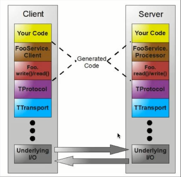

# Thrift
* The Apache Thrift software framework,for scalable cross-language services development,combines a software stack with a code generation engine to build services that work efficiently and seamlessly between C++,Java,Python,PHP,Ruby,Erlang,Perl,Haskell,C#,Cocoa,JavaScript,Node.js,Smalltalk,OCaml and Delphi and other Languages
* http://thrift.apache.org
* thrift最初由Facebook研发，主要用于各个服务之间的RPC通信，支持跨语言，常用的语言比如C++,Java,Python,PHP,Ruby,Erlang,Perl,Haskell,C#,Cocoa,Javascript,Node.js,Smalltalk,OCaml都支持。
* thrift是一个典型的CS(客户端/服务端)结构，客户端和服务器端可以使用不同的语言开发。既然客户端和服务器能使用不同的语言开发，那么一定就要有一种中间语言来关联客户端和服务端的语言，这种语言就是IDL（Interface Description Language）.
* thrift不支持无符号类型，因为很多编程语言不存在无符号类型，比如Java

## Thrift数据类型
* byte：有符号字节
* i16：16位有符号整数
* i32：32位有符号整数
* i64：64位有符号整数
* double：64位浮点数
* string：字符串

## Thrift容器类型
* 集合中的元素可以是除了service之外的任何类型，包括exception
* list：一系列由T类型的数据组成的有序列表，元素可以重复
* set：一系列由T类型的数据组成的无序集合，元素不可以重复
* map：一个字典结构，key为K类型，value为V类型，相当于Java中的HashMap

## Thrift工作原理
* 如何实现多语言之间的通信？
    * 数据传输使用socket（多种语言均支持），数据再以特定的格式（String等）发送，接收方语言进行解析
* 定义thrift的文件，由thrift文件（IDL）生成双方语言的接口、model,在生成的model以及接口中会有解码编码的代码

## Thrift IDL文件
```
namespace java com.test.thrift.demo
struct News{
    1:i32 id;
    2:string title;
    3:string content;
    4:string mediaFrom;
    5:string author;
}

service indexNewsOperatorService{
    bool indexNews(1:NewsModel indexNews)
    bool removeNewsById(1:i32 id)
}
```
### 结构体（struct）
* 就像C语言一样，thrift支持struct类型，目的就是将一些数据聚合在一起，方便传输管理。struct的定义形式如下：
```
struct People{
    1:string name;
    2:i32 age;
    3:string gender;
}
```
### 异常（exception）
* thrift支持自定义excepton，规则与struct一样
```
exception RequestException{
    1:I32 code;
    2:string reason;
}
```
### 服务（service）
* thrift定义服务相当于Java中创建Interface一样，创建的service经过代码生成命令之后就会生成客户端和服务端的框架代码。定义形式如下：
```
service HelloWordService{
    //service中定义的函数，相当于java interface中定义的方法
    string doAction(1:string name,2:i32 age);
}
```
### 类型定义
* thrift支持类似C++一样的typedef定义：
```
typedef i32 int
typedef i64 long
```
### 命名空间
* thrift的命名空间相当于java中的package的意思，主要目的是组织代码。thrift使用关键字namespace定义命名空间：
```
namesapce java com.test.thrift.demo
```
* 格式是：namespace 语言名 路径
### 文件包含
* thrift也支持文件包含，相当于C/C++中的include,Java中的import.使用关键字include定义：
```
include 'global.thrift'
```
### 注释
* thrift注释方式支持shell风格的注释，支持C/C++风格的注释，即#和//开关的的语句都当做注释，/**/包裹的语句也是注释。
### 可选与必选
* thrift提供两个关键字required,optional,分别用于表示对应的字段是必填的还是可选的
```
struce People{
    1:required string name;
    2:optional i32 age;
}
```
## 生成代码
* 了解了如何定义thrift文件之后，需要用定义好的thrift文件生成需要的目标语言的源码
* 首先需要定义thrift接口描述文件
* 参见data.thrift
## 服务端实现
```java
public class ThriftServer {
    public static void main(String[] args) throws TTransportException {
        TNonblockingServerSocket socket=new TNonblockingServerSocket(8899);
        THsHaServer.Args arg=new THsHaServer.Args(socket).minWorkerThreads(2).maxWorkerThreads(4);
        PersonService.Processor<PersonServiceImpl> processor=new PersonService.Processor<>(new PersonServiceImpl());

        arg.protocolFactory(new TCompactProtocol.Factory());
        arg.transportFactory(new TFramedTransport.Factory());
        arg.processorFactory(new TProcessorFactory(processor));

        TServer server=new THsHaServer(arg);//服务模型

        System.out.println("Thrift Server started!");
        server.serve();
    }
}
```
## 客户端实现
```java
public class ThriftClient {
    public static void main(String[] args) {
        TTransport transport=new TFramedTransport(new TSocket("localhost",8899),600);// 与服务器端呼应，数据传输方式：以、frame为单位进行传输，非阻塞式服务中使用
        TProtocol protocol=new TCompactProtocol(transport);// 与服务器端呼应,传输格式：压缩格式
        PersonService.Client client=new PersonService.Client(protocol);

        try{
            transport.open();

            Person person=client.getPersonByUsername("zhangsan");
            System.out.println(person.toString());

            System.out.println("========================");

            Person person1=new Person();
            person1.setUsername("zhaoliu");
            person1.setAge(34);
            person1.setMarried(false);

            client.savePerson(person);
        }catch(Exception exception){
            throw new RuntimeException(exception.getMessage(),exception);
        }finally {
            transport.close();
        }

    }
}
```
## Thrift架构


## thrift传输格式
* TBinaryProtocol--二进制格式
* TCompactProtocol--压缩格式
* TJSONProtocol--JSON格式
* TSimpleJSONProtocol--提供JSON只写协议，生成的文件很容易通过脚本语言解析。
* TDebugProtocol--使用易懂的可读的文本格式，以便于debug

## thrift数据传输方式
* TSocket-阻塞式socket
* TFramedTransport-以frame为单位进行传输，非阻塞式服务中使用。
* TFileTransport-以文件形式进行传输。
* TMemoryTransport-将内存用于I/O，Java实现时内部实际使用了简单的ByteArrayOutputStream。
* TZlibTransport-使用Zlib进行压缩，与其他传输方式联合使用。当前无Java实现。

## thrift支持的服务模型
* TSimpleServer-简单的单线程服务模型，常用于测试
* TThreadPoolServer-多线程服务模型，使用标准的阻塞式IO。
* TNonblockingServer-多线程服务模型，使用非阻塞式IO(需要使用TFramedTransport数据传输方式)
* THsHaServer-THsHa引入了线程池去处理，其模型把读写任务放到线程池去处理;Half-sync/Half-async的处理模式，Half-aysnc是在处理IO事件上（accept/read/write io）,Half-sync用于handler对rpc的同步处理    
## thrift对多语言的支持
* python作为Client
* java作为Server